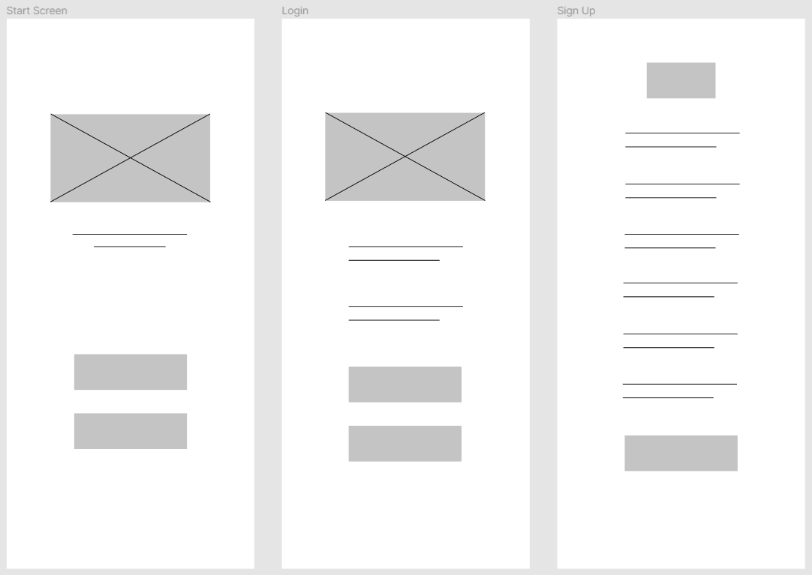
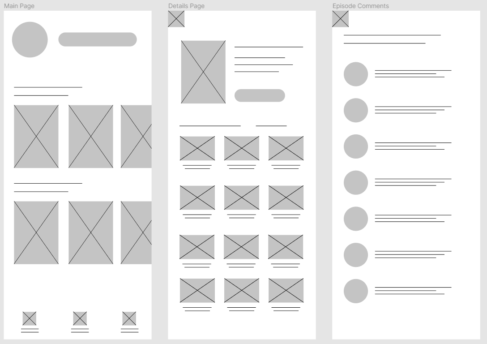
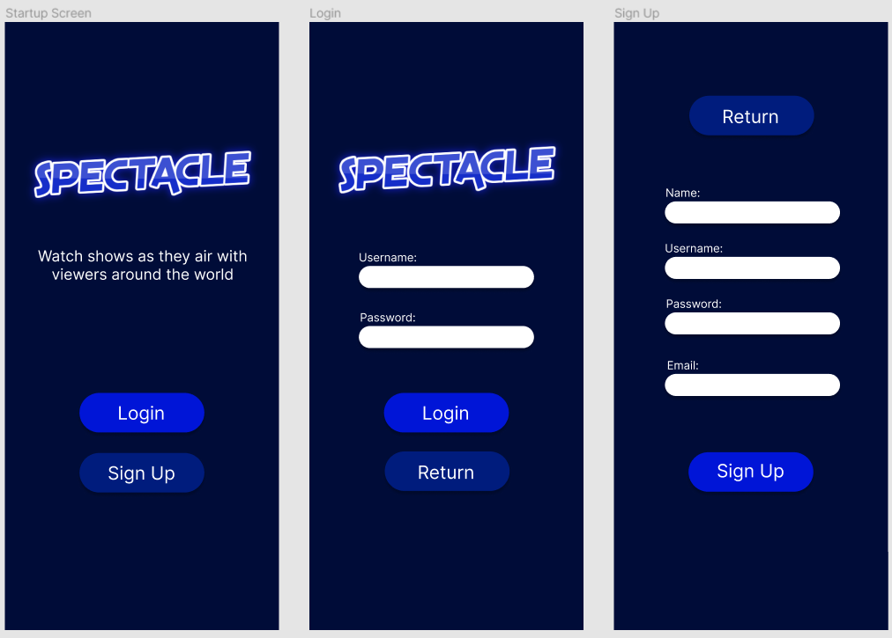

Original App Design Project - README
===

# Spectacle

## Table of Contents
1. [Overview](#Overview)
1. [Product Spec](#Product-Spec)
1. [Wireframes](#Wireframes)
2. [Schema](#Schema)

## Overview
### Description
Our app is meant to be a place for you to comment on episodes of shows you're watching and chat with other people who are also following a show. 

### App Evaluation
[Evaluation of your app across the following attributes]
- **Category:** Entertainment/Social
- **Mobile:** This app is primarily developed for mobile. A mobile app will allow users more convenience to use it whenever they're watching a show.
- **Story:** This app allows users to chat/discuss ongoing/archived TV shows. Users can post their comments to a live chat or discussion thread.
- **Market:** This market appeals to the same market as Netflix/Reddit. Specifically, people who's favorite pasttime is watching TV shows and then discussing it with other people.
- **Habit:** This app will hopefully compliment the user's TV watching experience enough to piggyback off their already established habit. Additionally, with being able to discuss your favorite TV shows with other fans, this should add another element of attachment.
- **Scope:** We will be developing a proof-of-concept with the app by supporting sign up/log in and 2-3 TV shows with full functionality in terms of chatting, discussing, etc. 

## Product Spec

### 1. User Stories (Required and Optional)

**Required Must-have Stories**

* User should be able to login to the app
* User should be able to sign up and create a new account
* User should be able to set a profile picture in the app
* User should be able to see the shows they’re following
* User should be able to search for new shows to follow
* User should be able to see a detailed view of a TV show
  - Description of show
  - Seasons and Episode count
  - Ratings
  - Hub Page for the show
* User should be able to see discussion threads for every episode in the show
* User should be able to comment on discussion threads and see their comments show up
* User should be able to see and message in a live chat for shows

**Optional Nice-to-have Stories**

- Report button
- Favoriting shows
- Friends list
- Expanded user profiles
- Can make their ‘favorite shows’ list public
- Can show favorite genres
- Can create a bio (280 characters like a tweet)
- Direct messaging capabilities

### 2. Screen Archetypes

* Login
* Sign Up
   * User can sign up and login to the recently created account
* Main Screen
   * The user's profile is in the corner
   * A selection of television shows that they are following/recommended is displayed
   * Search bar is also present to find specific shows
* Details Page
   * Gives more details about a show, such as descriptions, ratings, etc.
   * People can see the list of episodes, which will lead to people comments about said episode
* Episode Comments
   * A list of comments from other users about the episode selected
* Group Chat
   * A list of group chats available for television shows

### 3. Navigation

**Tab Navigation** (Tab to Screen)

* Home
* Group Chats
* Detailed Search

**Flow Navigation** (Screen to Screen)

* Home
   * Returns the user back to the home screen (or main screen)
* Group Chats
   * Shows a list of group chats that you are part of
* Detailed Search
   * Gives you more options in what you want to search for

## Wireframes
[Add picture of your hand sketched wireframes in this section]

### [BONUS] Digital Wireframes & Mockups
  

### [BONUS] Interactive Prototype

## Schema 
[This section will be completed in Unit 9]
### Models
[Add table of models]
### Networking
- [Add list of network requests by screen ]
- [Create basic snippets for each Parse network request]
- [OPTIONAL: List endpoints if using existing API such as Yelp]
